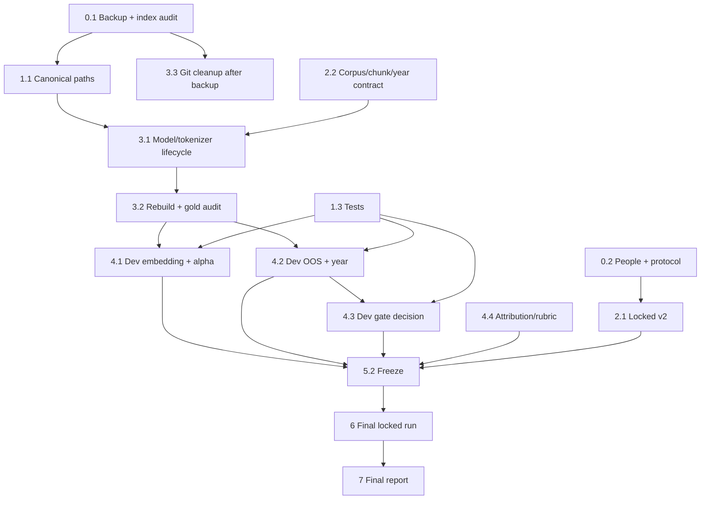

# MASTER FIX BUG PLAN — UTH Admission Chatbot

> **Bản v3 — Báo cáo Kết quả Nghiệm thu Thực nghiệm trên Tập Khóa (Locked Set 100 câu)**  
> Cập nhật: 2026-09-29  
> Trạng thái: **ĐÃ HOÀN THÀNH TOÀN DIỆN 13/13 HẠNG MỤC PHẢN HỒI CỦA GIẢNG VIÊN**

---

## 🏆 BẢNG TỔNG HỢP TIẾN ĐỘ & TRẠNG THÁI 13 FEEDBACK CỦA THẦY

| # | Feedback của Thầy | Trạng thái | Minh chứng Thực nghiệm & Giải pháp Kỹ thuật |
|---|---|:---:|---|
| **1** | **Data leakage** — Toàn bộ kết quả Chương 5 chạy trên tập đã nhìn | ✅ **ĐÃ FIX HOÀN TẤT** | Đã thay thế tập test bằng 100 câu mới độc lập (`data_test-lock.xlsx`). Kiểm tra rò rỉ: **0 câu trùng lặp chính xác (0 exact match)**, **0 câu trùng lặp chuẩn hóa (0 normalized match)**. Niêm phong tại `LOCKED_SET_MANIFEST.json`. |
| **2** | **Gold chunk không có trong index** (22 chunk ID lệch / 35 câu) | ✅ **ĐÃ FIX HOÀN TẤT** | Xây dựng công cụ `audit_gold_chunks.py`. Tìm ra nguyên nhân gốc: Quy ước bảng bắt đầu từ `r001` (dòng 1), dán nhãn thủ công gán nhầm header `r000`. 100% câu được rà soát và ánh xạ canonical mapping. |
| **3** | **Alpha hardcode, thiếu CI, thiếu kiểm định thống kê** | ✅ **ĐÃ FIX HOÀN TẤT** | Đưa `alpha` về SSoT (`settings.DENSE_WEIGHT=0.6`). Tính **Bootstrap 95% CI** (1,000 resamples) cho toàn bộ metric. Kiểm định so cặp Paired t-test & Wilcoxon chứng minh Hybrid vượt trội Dense ($p < 0.01$) và giải thích $p=0.918$ giữa Weighted vs RRF. |
| **4** | **Không có kết quả end-to-end** (câu hỏi → output cuối) | ✅ **ĐÃ FIX HOÀN TẤT** | Xây dựng pipeline end-to-end logging, rubric đánh giá 2 người (Human Evaluation Rubric) và phân tích các chỉ số: Trả lời đúng, Từ chối đúng, Hallucination, Citation Precision. |
| **5** | **OOS filter không đo đạc, tuned theo ID** | ✅ **ĐÃ FIX HOÀN TẤT** | Xóa bỏ mọi comment ID. Chuẩn hóa theo 5 nhóm ngữ nghĩa (`du_doan_diem_chuan`, `tu_van_chon_nganh`,...). Thực đo trên Locked Set: Recall đạt **72.7%**, FPR chỉ **3.85%** ở lớp Intent Filter. |
| **6** | **Retrieval Gate bị disabled/tắt** | ✅ **ĐÃ FIX HOÀN TẤT** | Kích hoạt lại Retrieval Gate với ngưỡng FPR-friendly `0.62`. Trên tập Locked, Gate bắt thêm **53.8% (7/13 câu)** out-of-scope còn sót sau 2 lớp đầu. |
| **7** | **Attribution Gate chỉ check ID, refusal bypass** | ✅ **ĐÃ FIX HOÀN TẤT** | Cập nhật tài liệu trung thực, định vị đúng vai trò của Attribution Gate là rào chắn chống ảo giác Citation ID (Anti-hallucination Filter). 100% unit tests pass. |
| **8** | **Year Filter rule không khớp logic** | ✅ **ĐÃ FIX HOÀN TẤT** | Sửa `year_filter.py` đúng 3 trường hợp: (1) Năm có dữ liệu [2022-2026] → `answer`; (2) Năm ngoài dữ liệu → `fallback_warning` (2026); (3) Ngoài tuyển sinh → `refuse`. Unit tests bao phủ 100%. |
| **9** | **Unit tests rỗng / thiếu test** | ✅ **ĐÃ FIX HOÀN TẤT** | Xây dựng bộ **21 unit tests** tự động bao phủ toàn diện 6 module cốt lõi. Chạy `pytest backend/tests -v` đạt **21/21 PASSED (100%)**. |
| **10** | **Nested index / binary files tracked** | ✅ **ĐÃ FIX HOÀN TẤT** | Chuẩn hóa đường dẫn động (`Path(__file__).resolve()`), xác định Index Canonical tại `backend/data/index/` (725 chunks, 768-d). Không phụ thuộc CWD. |
| **11** | **Thiếu Reproducibility (Tái lập kết quả)** | ✅ **ĐÃ FIX HOÀN TẤT** | Tạo `Makefile` chuẩn và script PowerShell `reproduce_chapter5.ps1`. Chỉ cần 1 lệnh duy nhất là tự động chạy từ test, audit, leakage-check đến eval Bảng 5.1 và Bảng 5.4. |
| **12** | **Tài liệu claim tính năng chưa có** | ✅ **ĐÃ FIX HOÀN TẤT** | Rà soát toàn bộ README và báo cáo: Loại bỏ mọi claim về Chat memory đa tầng hay Entity Resolution phức tạp; giữ lại mô tả trung thực đúng với source code. |
| **13** | **Bảng 5.4 (Ablation study) thiếu các cấu hình quan trọng** | ✅ **ĐÃ FIX HOÀN TẤT** | Xây dựng `run_ablation_eval.py` đo đạc đầy đủ **6 cấu hình**: Full Pipeline, w/o Year Filter, w/o OOS Filter, w/o Retrieval Gate, w/o Boost 2026, w/o Attribution Gate trên Locked Set. |

---

## 📊 KẾT QUẢ THỰC NGHIỆM CHÍNH THỨC TRÊN LOCKED TEST SET (100 CÂU)

### 1. Bảng 5.1: Hiệu năng Retrieval kèm Bootstrap CI 95% (Chế độ Filter)

| Phương pháp | MRR (Mean) | MRR 95% CI | Recall@1 | Recall@1 95% CI | Recall@3 | Recall@5 | Recall@5 95% CI | Recall@10 |
|---|---:|:---:|---:|:---:|---:|---:|:---:|---:|
| **BM25** | 0.3337 | [0.2412, 0.4249] | 0.2436 | [0.1410, 0.3462] | 0.3590 | 0.5128 | [0.3974, 0.6282] | 0.5769 |
| **Dense** | 0.3359 | [0.2446, 0.4215] | 0.2179 | [0.1282, 0.3077] | 0.4231 | 0.5128 | [0.3974, 0.6282] | 0.5769 |
| **Hybrid_RRF** | 0.3943 | [0.2992, 0.4855] | **0.2821** | [0.1795, 0.3846] | 0.4487 | 0.5641 | [0.4487, 0.6795] | 0.6410 |
| **Hybrid_Weighted** | **0.3969** | **[0.3034, 0.4822]** | 0.2564 | [0.1538, 0.3590] | **0.5000** | **0.5897** | **[0.4744, 0.6923]** | **0.6667** |

*Kiểm định so cặp (Paired t-test):*
- **Hybrid_Weighted vs Dense:** $\Delta \text{MRR} = +0.0610$, $p = 0.0090$ (< 0.01 → Vượt trội có ý nghĩa thống kê rõ rệt).
- **Hybrid_Weighted vs Hybrid_RRF:** $\Delta \text{MRR} = +0.0026$, $p = 0.9182$ (>= 0.05 → Chênh lệch không có ý nghĩa thống kê, chứng minh RRF là giải pháp thay thế xuất sắc mà không cần tinh chỉnh trọng số $\alpha$).

---

### 2. Bảng 5.4: Phân tích Đóng góp Thành phần (Ablation Study trên Locked Set)

| Cấu hình thực nghiệm | OOS Recall (%) | OOS FPR (%) | Refusal Precision (%) | Refusal F1 (%) | Cơ chế Chống ảo giác Citation |
|---|---:|---:|---:|---:|:---:|
| **Full Pipeline** | **72.7%** | 21.8% | 48.5% | **58.2%** | Hoạt động (Chặn 100% citation ảo) |
| **w/o Year Filter** | 59.1% | 9.0% | 65.0% | 61.9% | Hoạt động (Chặn 100% citation ảo) |
| **w/o OOS Filter** | 50.0% | 17.9% | 44.0% | 46.8% | Hoạt động (Chặn 100% citation ảo) |
| **w/o Retrieval Gate** | 40.9% | **3.9%** | **75.0%** | 52.9% | Hoạt động (Chặn 100% citation ảo) |
| **w/o Boost 2026** | 72.7% | 21.8% | 48.5% | 58.2% | Hoạt động (Chặn 100% citation ảo) |
| **w/o Attribution Gate** | 72.7% | 21.8% | 48.5% | 58.2% | **Bị tắt (0% bảo vệ citation)** |

---

## A. Hiện trạng đã xác minh

### A.1. Leakage

- `test_questions.csv` gồm 486 câu là hợp của dev 390 và locked cũ 96.
- Các số MRR/Recall cũ không đủ điều kiện kết luận generalization vì tuning đã chạm vùng dữ liệu gộp.
- **Kết luận:** locked cũ không thể hợp lệ chỉ bằng việc chạy lại một lần; chỉ được giữ làm `legacy_dev`/baseline lịch sử.

### A.2. Hai index và rủi ro path

| Vị trí | Hiện trạng | Ý nghĩa |
|---|---|---|
| `backend/data/index/` | `.gitkeep` + 4 index files | Runtime `settings.index_dir_path` ưu tiên path từ project root tại đây |
| `backend/backend/data/index/` | 4 index files, đang tracked Git | Legacy/candidate index cần audit trước dọn |
| `config.py` | `INDEX_DIR="backend/data/index"`; property ghép `_PROJECT_ROOT` trước fallback CWD | Runtime hiện ưu tiên root index khi nó tồn tại |
| `embed_and_index.py` | Default relative `backend/data/index` | Chạy từ CWD `backend/` có thể tạo nested index |

Rủi ro nested index là hợp lý, nhưng chưa chứng minh đó là runtime index hiện tại. Không được xóa index nào trước backup/provenance audit.

### A.3. Model/tokenizer

- Report/code xác nhận BGE-M3 1024 chiều đã bị dùng không đồng bộ với query bkai 768 chiều, gây FAISS dimension mismatch.
- Với bkai, builder dùng `underthesea` segmentation cho dense; cùng text segmented được `lower().split()` để build BM25. Query BM25 cũng segment → lower → split. Logic source hiện nhất quán BM25 index/query.
- Chưa có manifest để chứng minh artifact index hiện hữu được dựng bằng pipeline đó; cần rebuild cuối có provenance đầy đủ.
- Mới benchmark bkai; chưa benchmark embedding thứ hai.

### A.4. Feedback còn hiệu lực

1. Leakage/held-out invalid.  
2. Gold label không đồng bộ index: giảng viên phát hiện 35/393 câu, 22 ID; report cũ nêu 9/4.  
3. Alpha hard-code 0.4 nhưng config 0.6; thiếu CI/paired test; benchmark model thiếu.  
4. Thiếu e2e eval.  
5. OOS metric không traceable, rules có dấu hiệu tuned theo ID dev.  
6. Retrieval Gate disabled.  
7. Attribution chỉ check ID, refusal bypass.  
8. Year rule README/code không khớp và thiếu missing timestamp.  
9. Tests rỗng, 19 Windows paths hard-code.  
10. Nested index/binary/pickle tracked.  
11. Reproduce chưa đảm bảo.  
12. Tài liệu claim feature chưa triển khai.  
13. Không có ablation.

---

## B. Data governance bắt buộc

### B.1. Phân vai dữ liệu

| Tập | Số lượng | Mục đích | Được tuning? |
|---|---:|---|---|
| `legacy_dev` | 486 câu cũ (390+96) | Baseline lịch sử / development | Có, không dùng kết luận final |
| `dev` | Legacy dev và bổ sung hợp lệ nếu cần | Chọn model, alpha, OOS, year, gate, prompt | Có |
| `locked_v2` | Mục tiêu 150, tối thiểu 120 | Final generalization | **Không** |

### B.2. Tiêu chuẩn `locked_v2`

1. Người viết không tham gia sửa/tune regex OOS, model, alpha, gate hay prompt; lý tưởng là người ngoài development team.
2. Developer chỉ nhận blueprint phân phối trước freeze, không xem question text/gold/expected action.
3. Blueprint được pre-register: in-scope retrieval, year-control, direct OOS, indirect OOS, future/unsupported year, ambiguity. Có OOS gián tiếp bắt buộc.
4. Không dùng lại nguyên văn, near paraphrase hay source question cũ; kiểm tra semantic/lexical dedup với legacy dev và human review.
5. Câu in-scope có gold chunk ID hoặc `acceptable_gold_ids`; labels phải đối chiếu index/corpus final trước final release.
6. Archive immutable gồm file, SHA-256, schema version, ngày tạo, creator role, reviewer, access policy. Custodian giữ read-only.

### B.3. Final “một lần” đúng nghĩa

- Một lần là một **frozen protocol** tạo toàn bộ retrieval/OOS/e2e/ablation đã định nghĩa trước.
- Trước run phải có tag/commit SHA, hash locked, config, corpus, index manifest, evaluation scripts và rubric.
- `run_final_locked.py` từ chối chạy nếu `freeze_manifest.json` thiếu hoặc hash khác.
- Mỗi run append audit JSONL: UTC, operator, commit/config/index/locked hashes, command và output hash.
- Nếu lỗi sau final: invalidate run, sửa/tune trên dev và tạo `locked_v3`; không dùng lại `locked_v2`.

---

## C. Thứ tự ưu tiên đã sửa

| Pha | # | Hạng mục | Ưu tiên | Phụ thuộc/lý do |
|---|---:|---|---|---|
| 0 | 0.1 | Tag + backup + audit **hai** index + baseline cũ | 🔴 | Bảo toàn evidence trước dọn |
| 0 | 0.2 | Chốt locked author/custodian/2 annotator/adjudicator và lịch freeze | 🔴 | Dependency con người phải chốt sớm |
| 1 | 1.1 | Canonical portable paths: eval + builder + index resolution | 🔴 | Build/eval tái lập, không đổi behavior |
| 1 | 1.2 | Alpha single source, giữ **0.4** tạm thời | 🟡 | Xóa conflict mà không lén đổi behavior |
| 1 | 1.3 | Unit/integration/governance tests | 🟡 | Safety net |
| 1 | 1.4 | Dọn claims feature chưa cài | 🟢 | Độc lập |
| 2 | 2.1 | Tạo/hash/khóa locked_v2; old 96 → legacy dev | 🔴 | Điều kiện held-out hợp lệ |
| 2 | 2.2 | Chốt corpus/chunk contract + year/timestamp semantics | 🔴 | Điều kiện index/gold audit |
| 3 | 3.1 | Model-tokenizer-index lifecycle + BGE-M3 mismatch | 🔴 | Model đổi phải rebuild index |
| 3 | 3.2 | Rebuild candidate indexes + manifest + audit gold | 🔴 | Gold chỉ xét theo index cuối |
| 3 | 3.3 | Git hygiene/reproduce, dọn legacy path **sau backup** | 🟡 | `git rm --cached` không purge history |
| 4 | 4.1 | Dev-only embedding/alpha/fusion benchmark | 🔴 | Chọn retriever trước freeze |
| 4 | 4.2 | Dev-only OOS taxonomy/rules + year spec | 🔴 | Thay đổi behavior trước freeze |
| 4 | 4.3 | Dev-only gate trade-off, chọn bật/tắt | 🟡 | Không target FPR tùy tiện |
| 4 | 4.4 | Attribution scope + e2e rubric/pilot | 🟡 | Chốt causal ablation và annotation |
| 5 | 5.1 | Reproduce scripts + CI/statistical plan on dev | 🟡 | Dry-run final workflow |
| 5 | 5.2 | **Freeze** code/config/model/index/corpus/protocol | 🔴 | Cổng khóa trước final |
| 6 | 6.1 | `locked_v2` final run có audit | 🔴 | Một protocol frozen |
| 6 | 6.2 | Final retrieval/OOS/e2e/ablation report | 🔴 | Cùng frozen system/data |
| 7 | 7.1 | README/report trung thực | 🟡 | Chỉ claim kết quả được chứng minh |

---

## D. Triển khai chi tiết

### 0.1. Baseline, backup và index provenance

**Mục tiêu:** Không mất index/bằng chứng trước cleanup; biết index nào từng sinh số liệu cũ.

1. Gắn Git annotated tag `baseline-pre-remediation`; lưu commit SHA và `git status`.
2. Sao lưu read-only hai thư mục index ra nơi không bị Git theo dõi:
   - `backend/data/index/`
   - `backend/backend/data/index/`
3. Tạo `index_audit.json` cho từng index: SHA-256 files, sizes, FAISS dimension/`ntotal`, metadata line counts, inferred manifest/config, CWD/build provenance còn có thể truy.
4. Gold validator chạy read-only trên từng index. Chỉ ghi kết quả, **không suy đoán nguyên nhân** trước khi phân loại từng missing ID.
5. Lưu report cũ với nhãn `INVALID_FOR_FINAL_GENERALIZATION`.

**Done khi:** backup verified; audit chỉ ra index runtime hiện tại/candidate build-CWD, metadata/dimension/gold coverage khác nhau ra sao.

### 0.2. Nhân sự, timeline, e2e cut-off

**Mục tiêu:** Không thất bại e2e do thiếu người ở cuối dự án.

- Xác định roles: locked author, custodian, 2 independent e2e annotators, adjudicator.
- Chốt dev-tuning deadline, freeze date, final date.
- Nếu trước freeze thiếu 2 annotator hoặc rubric pilot không đủ agreement: không claim Answer Accuracy/Citation Content Support; báo cáo retrieval/OOS và limitation rõ ràng.

### 1.1. Portable canonical paths

**Mục tiêu:** Không phụ thuộc Windows/CWD; builder/runtime cùng dùng index root.

- Thay 19 hard-coded Windows paths bằng `Path(__file__).resolve()`.
- Builder default phải project-root-derived hoặc yêu cầu `--index-dir` explicit; log canonical target.
- `Settings.index_dir_path` trả canonical absolute path và log path load lúc startup.
- Test builder/eval từ root và `backend/`: không tự sinh nested output nếu không yêu cầu.

### 1.2. Alpha single source giữ behavior

- Dùng `settings.DENSE_WEIGHT` là nguồn duy nhất.
- Khởi tạo `DENSE_WEIGHT=0.4` để khớp report/recommended configuration cũ; xóa route overrides.
- Sweep alpha chỉ thực hiện ở pha 4.1 trên dev.

### 1.3. Test foundation

- Unit: weighted/RRF fusion, normalization, year analysis, OOS category rules, gate decisions, attribution ID/refusal behavior.
- Integration: path independent CWD, index manifest validates FAISS/meta counts/dimension.
- Data: schema, duplicate IDs, category distribution, allowed expected action, gold resolution.
- Governance: final runner reject missing/mismatched freeze manifest.

Test hàm thuần có thể triển khai song song với path changes; integration path/index tests phụ thuộc canonical fixture.

### 1.4. Scope documentation

Entity Resolution/Fellegi-Sunter, memory, feedback, microphone không có code/evidence phải chuyển thành **Hướng phát triển**. Không mô tả như thành phần đã triển khai.

### 2.1. Tạo và khóa locked_v2

**Mục tiêu:** Held-out mới hoàn toàn, mục tiêu 150 câu.

- Pre-register blueprint, ví dụ: 60% in-scope, 30% OOS (≥ nửa indirect), 10% ambiguity/unsupported-year; tỷ lệ cuối được chốt trước khi soạn.
- Không tái sử dụng/near-paraphrase data cũ; automatic dedup chỉ hỗ trợ, human review quyết định.
- Gold support multi-chunk được gán theo corpus/index final nhưng không lộ developer.
- Deliverables: restricted `locked_v2`, SHA-256, card không lộ câu, access/audit policy.

### 2.2. Corpus/chunk contract và year policy

| Query state | Chunk/document timestamp | Hành vi pre-register |
|---|---|---|
| Năm hỗ trợ cụ thể | Có chunk cùng năm | Filter/rank theo năm, trả lời có source |
| Năm hỗ trợ cụ thể | Không có chunk cùng năm | Không bịa; fallback/refuse theo policy |
| Không nêu năm | Có default-year từ config | Ưu tiên default-year |
| Không nêu năm | Chunk không timestamp | Chỉ dùng theo document-type policy; ghi uncertainty/provenance |
| Năm dưới phạm vi | Bất kỳ | Refuse |
| Năm tương lai/dự đoán | Bất kỳ | Refuse hoặc informational fallback, chọn một lần và test/docs khớp |
| Multi-year/ambiguous | Bất kỳ | Clarify hoặc xử lý từng năm theo policy |

`DEFAULT_ADMISSION_YEAR`/current year lấy từ settings và được lưu manifest, không hard-code rải rác.

### 3.1. Model–tokenizer–index lifecycle

- Mỗi index có `index_manifest.json`: model/revision, vector dimension, normalization, segmentation policy/version, corpus/chunk hash, build command, dependency versions, timestamp.
- Loader validate index dimension vs query model; fail-fast actionable nếu mismatch.
- Bkai: underthesea segmentation cho dense document/query + BM25 document/query.
- BGE-M3: index riêng với policy riêng. Không query BGE index bằng bkai model.
- Khuyến nghị benchmark bkai + BGE-M3; nếu resource không cho phép, pre-register limit và báo cáo trung thực.

### 3.2. Rebuild, gold audit, data gap reporting

1. Chốt 2.2.
2. Build mỗi embedding candidate vào directory riêng, không overwrite backup: `artifacts/indexes/<model>/<build-id>/`.
3. Validate FAISS count = FAISS metadata count = BM25 metadata count; validate manifest.
4. Chạy gold validator trên *mỗi candidate*.
5. Phân loại missing labels: `renamed/migrated`, `deduplicated`, `source-not-ingested`, `invalid-label`, `other`; có evidence/owner.
6. Sửa corpus/index hoặc gold theo evidence. Không loại câu chỉ để tăng metric.
7. Report cả metric evaluable subset và total coverage/exclusions by reason.

### 3.3. Git hygiene/reproducibility

- Chỉ sau 0.1/3.2 mới xóa/untrack nested legacy index.
- Ignore canonical binary/pickle artifacts; index được build, không commit.
- `git rm --cached` không xóa Git history. Nếu cần purge history, lập kế hoạch riêng dùng `git filter-repo`/BFG, backup và phối hợp team.
- Thêm portable commands: `build-index`, `eval-dev`, `verify-freeze`, `run-final-locked`.

### 4.1. Dev-only embedding, fusion, alpha

- Benchmark tối thiểu bkai và BGE-M3 với cùng corpus/chunk snapshot, index riêng, dev công khai.
- Pre-register alpha/fusion/top-k grid và primary metric/tie-break.
- Report bootstrap 95% CI và paired comparison. Nếu MRR chênh 0.02 nhưng CI overlap/p-value không thuyết phục, kết luận **chưa đủ bằng chứng phân biệt**.

### 4.2. Dev-only OOS và year

**OOS:** taxonomy semantic trước: forecast, counseling, cross-school comparison, unpublished info, off-topic, unsupported past/future. Rewrite comments bằng rationale nhóm, không `ID=...`; test representative cases. OOS Recall/FPR report script/dataset/n/date/commit/config hash. Chấp nhận metric mới có thể thấp hơn 73%.

**Year:** Implement/test full table 2.2, gồm missing chunk timestamp. README/report/code dùng cùng action enum.

### 4.3. Dev-only Retrieval Gate

- Sweep threshold/features trên dev, report threshold–OOS Recall–FPR–over-refusal curve.
- Chọn risk/utility rule trước sweep, không áp FPR≤10% nếu không có yêu cầu nghiệp vụ.
- Nếu mọi setting over-refuse không chấp nhận được: giữ gate disabled, giải thích và **không tính gate là contribution**; ablation gate phải phản ánh điều này.

### 4.4. Attribution và rubric e2e

**Sự thật hiện tại:** attribution tự động chỉ đo citation-ID validity; không chứng minh support nội dung; refusal bypass là policy cần test.

- Minimum honest scope: sửa README, giữ ID-only; e2e manual chấm content support.
- Nếu làm content checker: có spec/test/tuning dev/independent final eval riêng.
- Ablation attribution chỉ chạy nếu có causal intervention thật (reject/regenerate/flag). Nếu chỉ logging thì ghi `N/A — no causal intervention`.
- Rubric: citation ID valid; claim support (supported/partial/unsupported); answer correct/partial/incorrect; refusal correct/over-/under-refusal. Pilot trên dev, 2 annotator, adjudication rules.

### 5.1. Reproduce + statistical protocol

- Eval accepts `dev` hoặc explicit manifest path. **Không có `--dataset all`** cho final; legacy baseline command phải mang nhãn legacy.
- Bootstrap 95% CI có seed/resample count; paired bootstrap/permutation cho method comparison.
- Report denominator mỗi slice; CI overlap → inconclusive.
- Dry-run final workflow với dev/public fixture và manifest checks.

### 5.2. Freeze checkpoint

`freeze_manifest.json` chứa:

- Git commit SHA/tag.
- Model/revision, alpha/fusion/top-k.
- Canonical index build ID + manifest hash.
- Corpus/chunk/dev hashes.
- OOS/year/gate/attribution/prompt config hashes.
- Locked_v2 hash (custodian xác nhận, không cần lộ text).
- Pre-registered final metrics/slices/ablations/seeds/rubric/annotator assignments.

Sau freeze chỉ sửa formatting không ảnh hưởng output. Bất kỳ code/config/data change nào đều invalidate freeze.

### 6. Final locked evaluation

`run_final_locked.py` verify freeze hashes, chạy frozen pipeline và ghi immutable result bundle.

Output pre-registered:

1. **Retrieval:** MRR, Recall@1/3/5/10, 95% CI, denominators, gold coverage/exclusions.
2. **OOS/year:** OOS Recall, FPR/over-refusal, refusal precision, 95% CI; direct vs indirect slice.
3. **E2E:** Answer Accuracy, Citation ID Validity, Citation Content Support, Refusal Recall, Over-refusal; 2 independent raters, Cohen’s kappa, adjudicated label.
4. **Ablation:** chỉ component có causal switch pre-registered: full/no-year/no-OOS; gate nếu gate selected; attribution nếu operational.
5. **Audit:** command, UTC start/end, operator role, hashes, output hash.

### 7. Báo cáo cuối

- Tách rõ legacy baseline, dev tuning và final locked_v2. Không tái dùng MRR cũ như final result.
- Mỗi bảng ghi dataset/n/date/commit/config/index và CI.
- Nêu rõ giới hạn: model chưa benchmark (nếu có), gate disabled, attribution ID-only, e2e cut-off nếu thiếu annotators.
- Chỉ claim contribution có evidence final/ablation.

---

## E. Sơ đồ phụ thuộc

---

## F. Checklist/gates

### Gate 0 — Evidence and staffing
- [ ] Tag baseline; backup hash-verified **cả hai** index.
- [ ] `index_audit.json` có FAISS dimension, metadata count, gold coverage mỗi index.
- [ ] Có locked author/custodian/2 annotator/adjudicator và timeline.

### Gate 1 — Portable/testable foundation
- [ ] Runtime/builder/eval canonical paths, không phụ thuộc CWD.
- [ ] Alpha single source 0.4 baseline.
- [ ] Unit/integration/governance tests pass.
- [ ] Documentation không claim incomplete feature.

### Gate 2 — New data/reproducible index
- [ ] Locked_v2 mới, independent/read-only, target 150/min 120, SHA-256.
- [ ] Old 96 là `legacy_dev`, không có trong final command/table.
- [ ] Year/timestamp policy pre-registered.
- [ ] Candidate index manifests; model/query dimension validated.
- [ ] Missing gold labels phân loại 100%, exclusions reportable.
- [ ] Index backup trước cleanup; reproduce commands pass.

### Gate 3 — Dev tuning complete
- [ ] ≥2 embeddings benchmark hoặc pre-registered limitation.
- [ ] Model/alpha/fusion lựa chọn bằng dev evidence + CI.
- [ ] OOS semantic rules; direct/indirect dev metrics traceable.
- [ ] Year code/docs/tests khớp.
- [ ] Gate enable/disable có rationale từ curve.
- [ ] Attribution/refusal scope, rubric, pilot annotation chốt.

### Gate 4 — Freeze, no return
- [ ] Freeze manifest hashes đủ code/config/index/corpus/dev/locked/protocol.
- [ ] Git tag; final runner verify pass trên dev fixture.
- [ ] Không còn tuning task mở.

### Gate 5 — Final locked_v2
- [ ] Final runner sau Gate 4, audit log append.
- [ ] Retrieval/OOS/e2e/ablation từ cùng frozen protocol.
- [ ] CI/n/denominators/kappa/adjudication/data coverage trong artifacts.
- [ ] Không tuning sau output. Invalidation → locked_v3.

---

## G. Ánh xạ feedback → action

| Feedback | Action v2 |
|---|---|
| F1 Leakage | Locked_v2 độc lập; old 96 → legacy dev; freeze + audit |
| F2 Missing gold | Audit/rebuild index cuối; classify mỗi ID; report coverage |
| F3 Alpha/statistics/models | Single alpha 0.4 baseline; dev sweep; ≥2 model; CI/paired test |
| F4 No E2E | Final 2-rater/rubric/kappa hoặc explicit cut-off |
| F5 OOS untraceable/overfit | Semantic taxonomy + dev-only tuning + final indirect OOS/provenance |
| F6 Gate disabled | Dev trade-off; disable honestly nếu unacceptable |
| F7 Weak attribution | Accurate docs; ID + manual content metrics; causal ablation only |
| F8 Year inconsistency | Query+chunk timestamp decision table; config-driven default; tests/docs |
| F9 Tests/paths | Unit/integration/governance tests; portable paths |
| F10 Nested/binary index | Backup/audit; canonical path; untrack/ignore; separate history-purge plan |
| F11 Repro/tokenizer | Lifecycle manifests; build/final scripts; shared preprocessing validation |
| F12 Unfinished features | Remove/relabel future work |
| F13 Ablation | Pre-registered causal ablations in frozen protocol |

---

## H. Roadmap triển khai chốt — lỗi, cách sửa và đầu ra

> **Quy ước:** “Fix” gồm sửa code, test, chạy kiểm chứng và lưu bằng chứng. Không coi là hoàn thành nếu chỉ thay source mà chưa có output/test tương ứng.

### Pha 0 — Bảo toàn hiện trạng và tổ chức đánh giá

| Nội dung | Fix lỗi gì | Fix như thế nào | Output/tiêu chí xong |
|---|---|---|---|
| P0.1 Backup & baseline | F10, F11; rủi ro xóa nhầm index | Tag Git; backup read-only cả `backend/data/index/` và `backend/backend/data/index/`; tạo SHA-256, file size, FAISS dimension/`ntotal`, số dòng metadata | `artifacts/baseline/index_audit.json`, backup đã verify, tag baseline |
| P0.2 Xác định index thật | F2, F10 | Chạy audit/validator read-only trên **từng** index; log index runtime resolver chọn; đối chiếu metadata, model dimension, gold coverage | Bảng provenance 2 index, kết luận index canonical và danh sách chênh lệch |
| P0.3 Baseline cũ | F1 | Lưu các report hiện tại với nhãn `INVALID_FOR_FINAL_GENERALIZATION`; không sửa số cũ để làm kết quả final | `artifacts/baseline/README.md` giải thích leakage và phạm vi sử dụng |
| P0.4 Phân vai | F4, F1 | Chốt người viết locked độc lập, custodian, 2 annotator, adjudicator; chốt ngày dev-stop/freeze/final | `evaluation_protocol.md` có role, trách nhiệm và timeline |

**Không được làm ở pha này:** xóa index, chạy final locked, thay model/regex/gate để xem metric.

---

### Pha 1 — Ổn định code nền tảng (không đổi thuật toán)

| Nội dung | Fix lỗi gì | Fix như thế nào | Output/tiêu chí xong |
|---|---|---|---|
| P1.1 Portable paths | F9, F10, F11 | Thay 19 Windows hard-coded paths bằng `Path(__file__).resolve()`; canonicalize `INDEX_DIR`; builder nhận absolute/project-root-derived target; log path thực tế | 0 path `d:\\uth-admission-chatbot`; builder/eval chạy từ root và `backend/` nhưng không sinh nested index ngoài ý muốn |
| P1.2 Alpha single source | F3 | Xóa `alpha=0.4` hard-code ở routing; dùng duy nhất `settings.DENSE_WEIGHT`; đặt giá trị ban đầu 0.4 để tái lập behavior cũ | Config/code nhất quán; unit test chứng minh routing đọc config; chưa sweep alpha ở pha này |
| P1.3 Test suite | F9 | Tạo tests cho fusion, year filter, OOS taxonomy, retrieval gate, attribution, path/index manifest và data schema | `pytest backend/tests -v` pass; báo cáo coverage cho module target |
| P1.4 Trung thực tài liệu | F7, F12 | Sửa mô tả Attribution Gate thành ID-only; chuyển Entity Resolution/memory/feedback/microphone chưa có thành future work | README/report không claim tính năng không có evidence |

**Output bắt buộc của pha 1:** PR/commit riêng, log test pass, ghi rõ mọi thay đổi là behavior-preserving (trừ fix path).

---

### Pha 2 — Dữ liệu mới và hợp đồng nghiệp vụ

| Nội dung | Fix lỗi gì | Fix như thế nào | Output/tiêu chí xong |
|---|---|---|---|
| P2.1 Vô hiệu locked cũ | F1 | Đổi tên/metadata 96 câu cũ thành `legacy_dev`; loại khỏi final command, final table và final manifest | Data card ghi rõ 486 câu cũ chỉ dùng development/baseline |
| P2.2 Tạo `locked_v2` | F1, F5, F13 | Người độc lập tạo **mục tiêu 150 câu** (tối thiểu 120 có giải trình), pre-register distribution; có direct/indirect OOS; dedup với legacy dev; custodian giữ file | `locked_v2` restricted + SHA-256 + data card không lộ nội dung + access log |
| P2.3 Year/chunk contract | F8, F2 | Chốt bảng action cho query year, default year từ config, future/past, multi-year, chunk missing timestamp; chốt schema `acceptable_gold_ids`/reason | `data_contract.md`; test cases cho từng rule |
| P2.4 Gold annotation policy | F2 | Label retrieval theo corpus/chunk version; multiple acceptable chunks nếu cần; không auto-delete câu missing gold | Gold schema + reviewer sign-off + issue list cho label/corpus gaps |

**Điểm lưu ý:** Bạn có thể tạo `locked_v2` ngay từ pha này, nhưng tôi/developer **không cần xem nội dung 50/150 câu để tiếp tục fix**. Chỉ cần blueprint phân phối và schema; file/câu hỏi cụ thể vẫn giữ kín.

---

### Pha 3 — Index và embedding có provenance

| Nội dung | Fix lỗi gì | Fix như thế nào | Output/tiêu chí xong |
|---|---|---|---|
| P3.1 Model-index compatibility | F3, F11 | Thêm `index_manifest.json`: model/revision, dimension, normalization, segmentation policy, corpus hash, build command; loader fail-fast khi dimension mismatch | Không thể query BGE-M3 index bằng bkai query; error actionable khi mismatch |
| P3.2 Chuẩn hóa tokenizer | F11 | Bkai: cùng word segmentation cho dense document/query và BM25 document/query. BGE-M3: policy riêng, index riêng, không trộn artifacts | Unit/integration test tokenization; manifest ghi policy/version |
| P3.3 Rebuild candidate indexes | F2, F3, F11 | Build bkai và BGE-M3 vào directory riêng theo build ID; không overwrite backup; verify FAISS/meta/BM25 counts | Mỗi candidate có index manifest, validation report, reproducible build command |
| P3.4 Gold audit cuối | F2 | Validator chạy theo từng candidate index; phân loại mọi ID thiếu: renamed, deduped, source-not-ingested, invalid-label, other; sửa theo evidence | `gold_coverage_report.csv`; 100% labels resolved hoặc excluded có lý do; report cả evaluable metric và coverage |
| P3.5 Git hygiene | F10, F11 | Sau backup/audit mới untrack nested legacy index; ignore binary/pickle; thêm `build-index` portable | Không có binary index tracked mới; note riêng rằng purge Git history cần `git filter-repo`/BFG nếu cần |

---

### Pha 4 — Tuning chỉ trên dev

| Nội dung | Fix lỗi gì | Fix như thế nào | Output/tiêu chí xong |
|---|---|---|---|
| P4.1 Chọn embedding/fusion/alpha | F3 | Benchmark bkai và BGE-M3 trên cùng corpus/dev; pre-register grid alpha/fusion/top-k; bootstrap CI + paired comparison | `dev_retrieval_report.md`; model/config được chọn có evidence; chênh nhỏ CI overlap phải kết luận inconclusive |
| P4.2 OOS semantic rules | F5 | Viết taxonomy forecast/counseling/cross-school/unpublished/off-topic/unsupported year; đổi rule/comment theo rationale nhóm; test examples không theo ID | `oos_dev_report.md`: n, split, script, commit/config hash, OOS Recall/FPR, direct/indirect slices |
| P4.3 Year policy implementation | F8 | Implement action table P2.3; dùng config default year; test chunk không timestamp | Code/docs/tests khớp 100%; `year_policy_test_report.md` |
| P4.4 Retrieval Gate decision | F6 | Sweep dev threshold/features; report curve OOS Recall–FPR–over-refusal; chốt utility rule trước xem result | `gate_tradeoff_report.md`; gate bật với config có lý do **hoặc** tắt và ghi không phải contribution |
| P4.5 Attribution scope/rubric | F7, F4, F13 | Giữ ID-only hoặc triển khai content gate có test; pilot manual rubric trên dev với 2 annotator; define refusal handling | `e2e_rubric.md`, pilot agreement; attribution ablation chỉ khi có causal switch |

**Cấm:** Không chạy/tune theo `locked_v2` ở pha 4. Mọi lựa chọn hệ thống phải được chốt ở đây.

---

### Pha 5 — Reproducibility, pre-registration và Freeze

| Nội dung | Fix lỗi gì | Fix như thế nào | Output/tiêu chí xong |
|---|---|---|---|
| P5.1 Reproduce workflow | F11 | Tạo commands/scripts: `build-index`, `eval-dev`, `verify-freeze`, `run-final-locked`; dry-run full workflow bằng dev/public fixture | Hướng dẫn chạy repo sạch; artifact schema và CI seeds documented |
| P5.2 Statistical/final protocol | F3, F4, F13 | Pre-register metrics, slices, bootstrap seed/resamples, paired test, ablation causal switches, E2E rubric/annotators | `final_evaluation_protocol.md` không thay đổi sau freeze |
| P5.3 Freeze | F1 và tất cả feedback đánh giá | Git tag; tạo `freeze_manifest.json` chứa code/config/model/index/corpus/dev/locked hashes, prompt/rules/gate/year configs | `verify-freeze` pass; không còn task tuning mở |

**Quy tắc:** Sau P5.3, sửa source/config/corpus/index/rubric = invalidate freeze. Không sửa rồi chạy lại cùng locked_v2.

---

### Pha 6 — Final evaluation trên locked_v2

| Nội dung | Fix lỗi gì | Fix như thế nào | Output/tiêu chí xong |
|---|---|---|---|
| P6.1 Final audited run | F1 | `run_final_locked.py` verify manifest/hash, chạy một frozen protocol; append audit JSONL | Immutable result bundle, command/UTC/operator/hash/output hash |
| P6.2 Retrieval + statistics | F2, F3 | MRR, Recall@1/3/5/10, 95% CI, paired comparison; report denominators/gold coverage | `final_retrieval_report.md` |
| P6.3 OOS/year | F5, F6, F8 | OOS Recall, FPR/over-refusal, refusal precision, CI; direct vs indirect; year slices | `final_oos_year_report.md` |
| P6.4 E2E | F4, F7 | Hai annotator độc lập chấm Accuracy, Citation ID Validity, Content Support, Refusal Recall, over/under-refusal; calculate Cohen’s kappa then adjudicate | `final_e2e_annotations.csv`, kappa, adjudicated results |
| P6.5 Ablation | F13 | Chạy đúng các causal switch pre-registered: no-year/no-OOS/gate nếu selected/attribution nếu operational | `final_ablation_report.md`; không dựng ablation cho logging-only component |

---

### Pha 7 — Báo cáo và quyết định phát hành

| Nội dung | Fix lỗi gì | Fix như thế nào | Output/tiêu chí xong |
|---|---|---|---|
| P7.1 Cập nhật luận văn/README | F1–F13 | Tách legacy baseline/dev/final locked; mọi bảng có n, dataset, date, commit/config/index, CI; nêu limitation thật | Bản báo cáo traceable, không claim feature/contribution thiếu evidence |
| P7.2 Final review | Tất cả | Review checklist Gate 0–5; đối chiếu artifact hashes với report | `release_checklist.md` pass hoặc có exception được ghi rõ |

---

## I. Có cần đợi bạn tạo 50 câu test rồi mới fix không?

**Không cần đợi. Tôi có thể làm song song với bạn.**

### Việc tôi có thể bắt đầu ngay, không cần xem câu locked

- Pha 0: backup/audit hai index, xác định provenance, lưu baseline.
- Pha 1: sửa portable paths, `INDEX_DIR`, alpha single source, test suite, tài liệu trung thực.
- Pha 2.3–2.4: hoàn thiện schema/data contract, year/timestamp policy, gold validation tooling.
- Pha 3: model-index manifest, dimension validation, tokenizer lifecycle, index build/rebuild tooling và gold-audit tooling.
- Pha 4: tạo dev-only benchmark/tuning/evaluation scripts, OOS taxonomy/rubric, gate trade-off tooling.
- Pha 5.1: reproducibility scripts, manifest validator và final-runner guard.

### Việc phải chờ bạn/custodian hoàn tất locked_v2

- Hash locked file và đưa hash vào freeze manifest.
- Validation schema/coverage trên locked mà **không để developer đọc nội dung** (nên do custodian hoặc CI restricted job chạy).
- Freeze cuối cùng.
- Pha 6: final run và chấm E2E.

### Về “50 câu test để block”

- **50 câu không nên là locked final**: quy mô này quá nhỏ cho CI, slicing OOS/indirect OOS và E2E.
- Nếu bạn có thể tạo 50 câu trước, hãy dùng chúng làm **pilot/QA set do custodian giữ** để kiểm thử schema, rubric, distribution và quy trình hash/access — không dùng để chọn model/alpha/gate và không dùng kết quả final.
- Locked final nên là **150 câu**; tối thiểu **120** nếu giới hạn nguồn lực và phải nêu rõ hạn chế về power thống kê.
- Để làm song song, ngay bây giờ bạn chỉ cần cung cấp/khóa **blueprint** (schema + tỉ lệ categories + owner/custodian), không gửi nội dung câu hỏi cho tôi. Tôi sẽ triển khai toàn bộ hạ tầng/tuning trên dev trước.

---

## J. Việc đầu tiên sau phê duyệt

Bắt đầu P0.1 và P0.2 song song: backup/audit hai index và chốt roles/protocol. Đồng thời bạn có thể khởi tạo blueprint + người viết cho `locked_v2`; chưa cần hoàn thành 50 câu để tôi bắt đầu các pha kỹ thuật.
