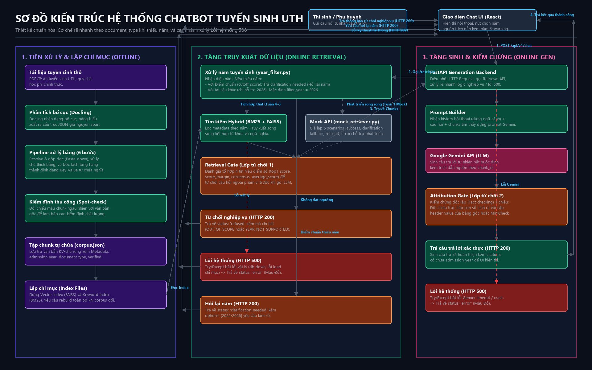

# Chatbot Hỗ trợ Tư vấn Tuyển sinh UTH

Dự án nghiên cứu và xây dựng hệ thống hỏi đáp tuyển sinh tự động dựa trên kiến trúc RAG.

---

## 1. Kiến trúc Hệ thống (System Architecture)

### 1.1. Sơ đồ Luồng Hoạt động (System Flow Diagram)

Dưới đây là sơ đồ luồng hoạt động (Offline và Online) của hệ thống:




### 1.2. Giải thích Luồng hoạt động

Hệ thống vận hành theo 3 giai đoạn chính:

#### Giai đoạn 1: Chuẩn bị dữ liệu và Lập chỉ mục (Offline)
* **Luồng:** `Tài liệu thô` -> `Docling (tách bảng)` -> `Pipeline 6 bước (gộp dọc, chú thích)` -> `KV-Chunking (tạo câu tự chứa)` -> `Spot-check (verified: true)` -> `FAISS & BM25 Indexing`.
* **Mô tả:** Spot-check kiểm tra thủ công được thực hiện sau khi tạo câu tự chứa (KV-Chunking) để rà soát chất lượng các chunks đã sinh ra và đối chiếu với tài liệu gốc (gán `verified = true`, ghi nhận tên người và thời gian kiểm định trên metadata của chunk) trước khi nạp vào chỉ mục FAISS & BM25.
* **Ghi chú quan trọng:** Bắt buộc rebuild toàn bộ index mỗi khi `corpus.json` thay đổi (không hỗ trợ cập nhật tăng dần).

#### Giai đoạn 2: Tiếp nhận câu hỏi và Tìm kiếm (Online Retrieval - Trân phụ trách)
* **Luồng:** `Câu hỏi` -> `year_filter.py (Trích xuất & Lọc)` -> `Tìm kiếm Hybrid` -> `Retrieval Gate (Đánh giá & Lọc)` -> `GenAPI`. (Tất cả trạng thái trung gian, lỗi hoặc hỏi lại từ Retrieval Stage đều trả về `GenAPI` xử lý, không gửi trực tiếp về WebUI).
* **Cơ chế Phân loại Loại tài liệu (CheckDocType):** `year_filter.py` thực hiện phân loại sơ bộ `document_type` từ câu hỏi thô bằng phương pháp so khớp từ khóa dựa trên luật (rule-based keyword matching) - ví dụ: câu hỏi chứa các cụm từ như 'điểm chuẩn', 'bao nhiêu điểm', 'trúng tuyển' sẽ được phân loại là `cutoff_score`; các loại câu hỏi khác được ánh xạ theo bộ từ khóa cố định cho 13 loại tài liệu còn lại. Phân loại sơ bộ này diễn ra trước khi Hybrid Retrieval chạy và chỉ nhằm mục đích định hướng luồng xử lý lọc năm tuyển sinh.
* **Quy tắc lọc theo năm (kết hợp `document_type`):**
  - **Năm ngoài khoảng (năm < 2022 hoặc năm > 2026):** Từ chối trực tiếp với mã lỗi `YEAR_NOT_SUPPORTED`.
  - **Nếu là Điểm chuẩn (`cutoff_score`):** Hỗ trợ dữ liệu từ 2022–2026. Nếu câu hỏi nêu năm cụ thể trong khoảng này, thực hiện tìm kiếm Hybrid. Nếu không nêu rõ năm, trả về status `"clarification_needed"` để yêu cầu người dùng chọn năm trên UI.
  - **Nếu là tài liệu khác (học phí, chỉ tiêu...):** Chỉ hỗ trợ thông tin năm mới nhất (2026). Nếu câu hỏi nêu năm cụ thể khác 2026 (2022–2025), từ chối trực tiếp với lỗi `YEAR_NOT_SUPPORTED` (thông báo tài liệu này chỉ có thông tin năm 2026). Nếu không nêu rõ năm, tự động mặc định `filter_year = 2026` để truy xuất.
* **Retrieval Gate:** Lọc chunks dựa trên 4 chỉ số điểm phù hợp. Nếu không đạt ngưỡng, từ chối trả lời (`refused` với mã `OUT_OF_SCOPE`).
* **Xử lý lỗi:** Trả về lỗi hệ thống (SYSTEM_ERROR 500) về GenAPI nếu có lỗi kết nối hoặc chỉ mục bị lỗi.

#### Giai đoạn 3: Sinh câu trả lời và Đối chiếu (Online Generation - Khoa phụ trách)
* **Luồng:** Chuyển tiếp lỗi/hỏi lại từ Retrieval hoặc nhận chunks hợp lệ + History -> `Prompt Builder` -> `Gemini API` -> `Attribution Gate` -> `Web UI`.
* **Kiểm soát chất lượng (Attribution Gate):** Đối chiếu trực tiếp con số trong câu trả lời với dữ liệu gốc (headers/values). Nếu khớp 100% thì hiển thị kèm trích dẫn, ngược lại từ chối (`Hallucination Refusal`).
* **Logic Fallback Điểm chuẩn 2026:**
  - Nếu người dùng hỏi điểm chuẩn năm 2026 nhưng cơ sở dữ liệu chưa có (chưa công bố chính thức), tầng Retrieval (`year_filter.py`) tự động sinh chuỗi cảnh báo cố định (`warning`) một cách deterministic và trả về.
  - `Prompt Builder` chèn chuỗi `warning` này vào làm chỉ thị hệ thống (system instruction).
  - Gemini API sinh câu trả lời diễn đạt tự nhiên dựa trên chỉ thị đó: thông báo chưa có điểm chuẩn 2026 -> cung cấp dữ liệu điểm chuẩn tham khảo từ 2023-2025 -> đưa ra cảnh báo đổi cách tính điểm chuẩn từ năm 2025 -> gợi ý nhập điểm quy đổi.
* **Xử lý lỗi:** Trả về lỗi hệ thống (HTTP 500) nếu Gemini bị timeout hoặc crash.

---

### 1.3. Ghi chú Thiết kế Quan trọng
* **Conversation Memory:** Lịch sử trò chuyện (`history`) được chuyển vào Prompt để LLM trả lời tiếp ngữ cảnh, không dùng để chạy truy xuất lại cơ sở dữ liệu.
* **Attribution Gate:** Thực hiện kiểm chứng 1 chiều (đối chiếu trực tiếp và từ chối nếu phát hiện sai lệch), không chạy vòng lặp sửa lỗi tự động (retry prompt) để tối ưu thời gian phản hồi.

---

## 2. Phạm vi Hỗ trợ (Scope Boundaries)

Quy định rõ ràng về phạm vi các nội dung được chatbot hỗ trợ (In-Scope) và từ chối hỗ trợ (Out-of-Scope) dựa theo Đề cương tốt nghiệp:

### 2.1. Nội dung hỗ trợ (In-Scope)
* **Thông tin tuyển sinh năm 2026:** Phương thức xét tuyển, điều kiện xét tuyển, chỉ tiêu tuyển sinh, ngành đào tạo.
* **Điểm chuẩn tuyển sinh:** Tra cứu điểm chuẩn của các năm **2022, 2023, 2024, 2025** và cập nhật năm **2026** (khi được công bố chính thức).
* **Thông tin học tập năm 2026:** Học phí, chính sách học bổng, chương trình đào tạo.
* **Thông tin nhập học năm 2026:** Hồ sơ nhập học, mốc thời gian tuyển sinh, quy chế/quy định nhập học.
* **Thông tin nhà trường năm 2026:** Địa chỉ các cơ sở, thông tin liên hệ tuyển sinh (các cơ sở học tập được bản đồ hóa vào phân loại tài liệu `contact_info`).

### 2.2. Nội dung từ chối hỗ trợ (Out-of-Scope)
* Dự đoán điểm chuẩn của năm tiếp theo/tương lai.
* Tư vấn chọn ngành học theo tính cách/sở thích cá nhân.
* Cơ hội việc làm cụ thể sau khi tốt nghiệp.
* Mức lương dự kiến sau khi ra trường.
* So sánh chương trình học/chất lượng đào tạo với các trường đại học khác.
* Tất cả các thông tin tuyển sinh chưa được nhà trường công bố chính thức.

---

## 3. API Contract (Khóa cứng giữa hai thành phần)

### 3.1. API 1: Truy xuất dữ liệu (`POST /api/v1/retrieve`)
*(Khoa gọi - Trân cung cấp endpoint)*

#### Tham số Yêu cầu (Request)
| Tham số | Kiểu dữ liệu | Bắt buộc | Mô tả |
| :--- | :--- | :--- | :--- |
| `query` | String | Có | Câu hỏi của người dùng (tối thiểu 1 ký tự) |
| `top_k` | Integer | Không | Số lượng chunks cần lấy (mặc định: 5, tối đa: 20) |
| `filter_year` | Integer | Không | Năm tuyển sinh đã xác định |

#### Cấu trúc Kết quả (Response)
| Trường | Kiểu dữ liệu | Mô tả |
| :--- | :--- | :--- |
| `status` | String | Trạng thái nghiệp vụ: `"success"`, `"clarification_needed"`, `"refused"`, `"error"` |
| `code` | String | Mã lỗi chi tiết: `"OUT_OF_SCOPE"`, `"YEAR_NOT_SUPPORTED"`, `"YEAR_CLARIFICATION_REQUIRED"`, `"SYSTEM_ERROR"` |
| `message` | String | Nội dung thông báo lỗi hoặc yêu cầu làm rõ |
| `options` | Array[Int] | Các năm tuyển sinh gợi ý (dùng khi status là clarification_needed và document_type là cutoff_score) |
| `warning` | String | Cảnh báo năm tuyển sinh |
| `chunks` | Array[Object] | Danh sách chunks dữ liệu tìm thấy kèm metadata chi tiết |
| `debug` | Object | Tín hiệu điểm số của Retrieval Gate phục vụ gỡ lỗi |

---

### 3.2. API 2: Hội thoại với người dùng (`POST /api/v1/chat`)
*(Giao diện React gọi - Backend Generation xử lý)*

#### Tham số Yêu cầu (Request)
| Tham số | Kiểu dữ liệu | Bắt buộc | Mô tả |
| :--- | :--- | :--- | :--- |
| `message` | String | Có | Câu hỏi hiện tại của người dùng |
| `history` | Array[Object]| Không | Mảng lịch sử trò chuyện `[{"role": "user"\|"assistant", "message": "..."}]` |
| `filter_year` | Integer | Không | Năm tuyển sinh người dùng đã chọn từ nút gợi ý trên UI |

#### Cấu trúc Kết quả (Response)
| Trường | Kiểu dữ liệu | Mô tả |
| :--- | :--- | :--- |
| `status` | String | Trạng thái nghiệp vụ: `"success"`, `"clarification_needed"`, `"refused"`, `"error"` |
| `answer` | String | Câu trả lời sinh ra hoặc thông báo yêu cầu chọn năm/từ chối |
| `warning` | String | Cảnh báo năm tuyển sinh hiển thị trên giao diện |
| `options` | Array[Int] | Các nút chọn năm gợi ý hiển thị trên giao diện (chỉ áp dụng khi hỏi về điểm chuẩn) |
| `citations` | Array[Object] | Danh sách nguồn trích dẫn (Tên tài liệu, trang, chương mục, năm) |

---

### 3.3. Chi tiết 5 Kịch bản Phản hồi của Hệ thống

Dưới đây là các định dạng JSON thực tế trả về từ `/api/v1/chat` tương ứng với từng kịch bản:

#### Kịch bản 1: Success (Thành công - HTTP 200)
```json
{
  "status": "success",
  "answer": "Theo Quyết định điểm chuẩn UTH năm 2025 (Trang 2, Mục II), điểm chuẩn ngành Công nghệ thông tin là 23.5 điểm.",
  "warning": null,
  "citations": [
    {
      "chunk_id": "diemchuan_2025_sec2_row_12",
      "document_name": "Quyet_dinh_diem_chuan_2025.pdf",
      "page": 2,
      "section": "II. Điểm chuẩn các ngành",
      "admission_year": 2025,
      "text": "Công nghệ thông tin. Điểm chuẩn: 23.5"
    }
  ]
}
```

#### Kịch bản 2: Clarification Needed (Hỏi lại năm tuyển sinh - HTTP 200)
*(Chỉ xảy ra khi document_type = cutoff_score)*
```json
{
  "status": "clarification_needed",
  "answer": "Vui lòng chọn năm tuyển sinh bạn muốn tra cứu điểm chuẩn:",
  "warning": null,
  "options": [2026, 2025, 2024, 2023, 2022],
  "citations": []
}
```

#### Kịch bản 3: Refused (Từ chối nghiệp vụ - HTTP 200)
```json
{
  "status": "refused",
  "answer": "Xin lỗi, câu hỏi nằm ngoài phạm vi hỗ trợ tư vấn tuyển sinh hoặc năm tra cứu không hỗ trợ.",
  "warning": null,
  "citations": []
}
```

#### Kịch bản 4: System Error (Lỗi hệ thống kỹ thuật - HTTP 500)
```json
{
  "status": "error",
  "answer": "Hệ thống đang gặp sự cố kết nối. Vui lòng thử lại sau.",
  "warning": null,
  "citations": []
}
```

#### Kịch bản 5: Validation Error (Lỗi xác thực định dạng đầu vào - HTTP 422)
```json
{
  "detail": [
    {
      "loc": ["body", "message"],
      "msg": "field required",
      "type": "value_error.missing"
    }
  ]
}
```

---

### 3.4. Đặc tả Giả lập của Mock API (`mock_retriever.py`)
Để Khoa phát triển Frontend/Generation độc lập ở Tuần 1, Mock API nhận Header `"X-Mock-Scenario"` (hoặc tham số truy vấn `mock_scenario`) để trả về dữ liệu tương ứng:
* `"success"`: Trả về HTTP 200 với danh sách chunks mẫu năm 2025/2026.
* `"fallback"`: Trả về HTTP 200 kèm warning cảnh báo năm.
* `"clarification"`: Trả về HTTP 200 với danh sách nút bấm năm gợi ý.
* `"refused"`: Trả về HTTP 200 với chunks rỗng và mã `OUT_OF_SCOPE`.
* `"error"`: Ném lỗi HTTP 500 để giả lập sập mạng/crash hệ thống.

---

## 4. Schema Dữ liệu & Cơ chế Ánh xạ

### 4.1. Cấu trúc Metadata Schema của Chunk
Mỗi chunk lưu trữ trong hệ thống bắt buộc bao gồm các thông tin sau:

| Trường | Kiểu dữ liệu | Vai trò | Ví dụ |
| :--- | :--- | :--- | :--- |
| `chunk_id` | String | Khóa chính định danh chunk | `"diemchuan_2025_sec2_row_12"` |
| `chunk_type`| String | Kiểu dữ liệu: `"table_row"` hoặc `"free_text"` | `"table_row"` |
| `text` | String | Nội dung văn bản của chunk | `"Công nghệ thông tin. Điểm chuẩn: 23.5"` |
| `faiss_id` | Integer | Vị trí ID tương ứng trong Vector Index | `142` |
| `bm25_id` | Integer | Vị trí ID tương ứng trong Keyword Index | `142` |
| `admission_year`| Integer| Năm tuyển sinh áp dụng | `2025` |
| `document_type`| String | 1 trong 13 phân loại tài liệu (xem enum bên dưới) | `"cutoff_score"` |
| `document_name`| String | Tên file PDF gốc phục vụ trích dẫn | `"Quyet_dinh_diem_chuan_2025.pdf"` |
| `page` | Integer | Số trang trong file PDF gốc | `2` |
| `section` | String | Tiêu đề chương mục | `"II. Điểm chuẩn"` |
| `table_id` | String | Định danh bảng gốc (chỉ áp dụng cho table_row) | `"table_diemchuan_1"` |
| `headers` | Array[Str] | Danh sách tiêu đề cột (chỉ áp dụng cho table_row)| `["Ngành", "Điểm chuẩn"]` |
| `values` | Array[Str] | Danh sách giá trị dòng (chỉ áp dụng cho table_row)| `["Công nghệ thông tin", "23.5"]` |
| `verified` | Boolean | Đánh dấu đã qua kiểm định thủ công chưa | `true` |
| `verified_by`| String | Tên người thực hiện kiểm định | `"Tran"` |
| `verified_at`| String | Thời gian thực hiện kiểm định (ISO 8601) | `"2026-08-01T10:00:00Z"` |

> [!IMPORTANT]
> **Quy định về phạm vi năm tuyển sinh:**
> * Riêng tài liệu loại **Điểm chuẩn (`cutoff_score`)**: Hệ thống hỗ trợ tra cứu trong khoảng năm **2022–2026**.
> * Các loại tài liệu khác còn lại: Chỉ lưu trữ và hỗ trợ tra cứu cho năm mới nhất (**2026**).

#### 13 Phân loại tài liệu tuyển sinh (`document_type`)
`admission_method` (phương thức xét tuyển), `admission_condition` (điều kiện xét tuyển), `quota` (chỉ tiêu), `major` (ngành đào tạo), `cutoff_score` (điểm chuẩn), `tuition_fee` (học phí), `scholarship` (học bổng), `training_program` (chương trình đào tạo), `application_profile` (hồ sơ nhập học), `timeline` (thời gian tuyển sinh), `enrollment_regulation` (quy chế/quy định nhập học), `contact_info` (địa chỉ, **cơ sở học tập**, thông tin liên hệ), `general_info` (giới thiệu chung).

### 4.2. Cơ chế Ánh xạ Chỉ mục vật lý
Khi chạy script tiền xử lý offline, các chunk sau khi làm sạch sẽ được xuất ra file JSON tổng hợp tại `data/processed/corpus.json` dưới dạng một mảng danh sách. 
Chỉ mục FAISS và BM25 được dựng theo đúng thứ tự mảng này. Khi tìm kiếm trả về chỉ số vật lý, Retrieval API chỉ cần truy cập phần tử tại index tương ứng của `corpus.json` để lấy đầy đủ Metadata phục vụ đối chiếu chéo.

---

## 5. Thiết lập Môi trường Phát triển (Development Env)

### 5.1. Cấu trúc Thư mục chuẩn của Dự án
Cấu trúc thư mục được phân chia rõ ràng các tệp chạy offline, runtime API, unit test, và thực nghiệm chất lượng:

```text
uth-admission-chatbot/
├── backend/                        # Python FastAPI Backend
│   ├── app/
│   │   ├── main.py                 # Khởi tạo server FastAPI
│   │   ├── core/
│   │   │   └── config.py           # Quản lý cấu hình bảo mật (.env) qua pydantic-settings
│   │   ├── app_shared/             # Thư mục dùng chung (chứa định nghĩa schemas chung)
│   │   ├── api/
│   │   │   ├── endpoints/
│   │   │   │   ├── retrieval.py    # API truy xuất thật (Trân)
│   │   │   │   ├── mock_retriever.py # Mock API hỗ trợ 5 kịch bản (Khoa)
│   │   │   │   └── generation.py   # API sinh & kiểm chứng (Khoa)
│   │   │   └── router.py
│   │   └── services/
│   │       ├── year_filter.py      # Bộ lọc & phân tích năm tuyển sinh (Trân)
│   │       ├── retriever.py        # Tìm kiếm Hybrid + Retrieval Gate (Trân)
│   │       └── generator.py        # Gọi Gemini + Attribution Gate (Khoa)
│   ├── pipeline/                   # Scripts chạy offline (parser/indexing)
│   │   ├── parser.py               # Chạy offline trích xuất Docling & 6 bước bảng
│   │   └── build_index.py          # Xây dựng vector FAISS và index BM25
│   ├── data/                       # Quản lý dữ liệu phân tầng rõ ràng
│   │   ├── raw/                    # Chứa PDF/Web gốc chưa xử lý
│   │   ├── processed/              # Chứa các chunk dạng JSON sau 6 bước xử lý (corpus.json)
│   │   └── index/                  # Chứa file chỉ mục FAISS index & BM25 index
│   ├── tests/                      # Thư mục chứa Unit Tests độc lập
│   │   ├── test_year_filter.py
│   │   ├── test_retriever.py
│   │   └── test_generator.py
│   ├── eval/                       # Thư mục thực nghiệm và đánh giá chất lượng
│   │   ├── test_questions.jsonl    # Bộ câu hỏi kiểm thử gán nhãn
│   │   ├── run_eval.py             # Script tự động chạy tính metrics
│   │   └── results/                # Lưu báo cáo kết quả chạy thực nghiệm
│   ├── requirements.txt
│   └── .env                        # Chứa Gemini API Key (Không đẩy lên git)
├── frontend/                       # React Frontend (Vite)
│   ├── src/
│   └── package.json
└── README.md
```

### 5.2. Danh sách thư viện cốt lõi
* **Backend (`requirements.txt`):**
  `fastapi`, `uvicorn`, `docling`, `sentence-transformers`, `faiss-cpu`, `rank-bm25`, `google-generativeai`, `pydantic-settings`, `pandas`, `pytest`.
* **Frontend (`package.json`):**
  `react`, `vite`, `axios`, `lucide-react`.
