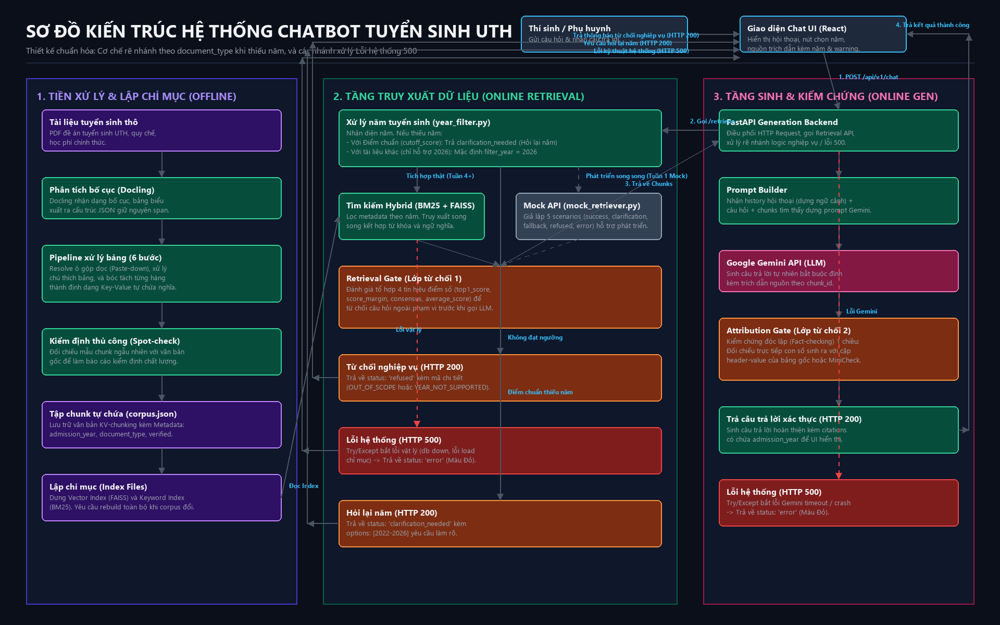

# Chatbot Hỗ trợ Tư vấn Tuyển sinh UTH

Dự án nghiên cứu và xây dựng hệ thống hỏi đáp tuyển sinh tự động dựa trên kiến trúc RAG.

---

## 1. Kiến trúc Hệ thống (System Architecture)

### 1.1. Sơ đồ Luồng Hoạt động (System Flow Diagram)

Dưới đây là sơ đồ luồng hoạt động (Offline và Online) của hệ thống:



### 1.2. Giải thích Luồng hoạt động

Hệ thống vận hành theo 3 giai đoạn chính:

#### Giai đoạn 1: Chuẩn bị dữ liệu và Lập chỉ mục (Offline)
* **Luồng:** `Tài liệu thô` -> `Docling (tách bảng)` -> `Pipeline 6 bước (gộp dọc, chú thích)` -> `KV-Chunking (tạo câu tự chứa)` -> `Spot-check (verified: true)` -> `FAISS & BM25 Indexing`.
* **Mô tả:** Spot-check kiểm tra thủ công được thực hiện sau khi tạo câu tự chứa (KV-Chunking) để rà soát chất lượng các chunks đã sinh ra và đối chiếu với tài liệu gốc (gán `verified = true`, ghi nhận tên người và thời gian kiểm định trên metadata của chunk) trước khi nạp vào chỉ mục FAISS & BM25.
* **Ghi chú quan trọng:** Bắt buộc rebuild toàn bộ index mỗi khi `corpus.json` thay đổi (không hỗ trợ cập nhật tăng dần).

#### Giai đoạn 2: Tiếp nhận câu hỏi và Tìm kiếm (Online Retrieval & OOS Filtering)
* **Luồng:** `Câu hỏi` -> `Lớp 1: year_filter.py (Lọc năm & chủ đề)` -> `Lớp 2: oos_filter.py (Lọc ý định ngoài phạm vi - Hướng C)` -> `Tìm kiếm Hybrid (dynamic routing)` -> `Lớp 3: Retrieval Gate (Điểm số chunk)` -> `Generator`.
* **Cơ chế Phân loại Loại tài liệu (CheckDocType):** `year_filter.py` thực hiện phân loại sơ bộ `document_type` từ câu hỏi thô bằng phương pháp so khớp từ khóa dựa trên bộ từ điển...
* **Quy tắc lọc theo năm thống nhất (Unified Admission Year Policy — Bảng quy tắc chuẩn):**

| Trường hợp câu hỏi | Điều kiện năm | Hành vi hệ thống (`status`) | Dữ liệu truy xuất & Xử lý |
|---|---|:---:|---|
| **Trong phạm vi + có dữ liệu** | Năm trong khoảng [2022, 2026] | `proceed` (answer) | Truy xuất chính xác dữ liệu của năm được yêu cầu |
| **Trong phạm vi + ngoài năm dữ liệu** | Năm tương lai (> 2026) hoặc quá khứ (< 2022) | `proceed` (fallback_warning) | Lấy dữ liệu năm gần nhất (2026) kèm thông báo cảnh báo thông tin chưa công bố |
| **Trong phạm vi + không rõ năm** | Không đề cập năm cụ thể | `proceed` (default 2026) | Mặc định sử dụng năm tuyển sinh hiện hành (2026) + Boost 20% điểm cho chunks 2026 |
| **Hỏi so sánh nhiều năm (Điểm chuẩn)** | Chứa từ khóa so sánh nhiều năm | `clarification_needed` | Yêu cầu người dùng chọn năm cụ thể [2022-2026] trên giao diện |
| **Ngoài phạm vi tuyển sinh (OOS)** | Câu hỏi không thuộc phạm vi tuyển sinh | `refused` | Từ chối trả lời lịch sự theo quy định |

* **Luồng lọc Out-of-Scope (OOS) 3 lớp thực tế:**
  1. **Lớp 1 (year_filter.py):** Lọc theo mốc năm không hợp lệ hoặc từ khóa ngoài phạm vi tuyển sinh.
  2. **Lớp 2 (oos_filter.py):** Lọc theo ý định ngữ nghĩa Hướng C (dự đoán điểm chuẩn, tư vấn chọn ngành, cơ hội việc làm, mức lương, so sánh trường khác) bằng Regex taxonomy.
  3. **Lớp 3 (Retrieval Gate - retrieval_gate.py):** Lọc theo điểm số truy xuất với ngưỡng tối ưu thực nghiệm `0.62`. Trên tập Locked, Gate bắt thêm **53.8% (7/13 câu)** out-of-scope hỏi gián tiếp còn lọt qua 2 lớp đầu.

#### Giai đoạn 3: Sinh câu trả lời và Đối chiếu (Online Generation)
* **Luồng:** Nhận chunks hợp lệ hoặc thông tin lỗi -> `Prompt Builder` -> `Gemini API` -> `Attribution Gate` -> `Web UI`.
* **Kiểm soát chất lượng (Attribution Gate):** Hoạt động như một rào chắn chống ảo giác trích dẫn (Anti-hallucination Filter). Kiểm tra danh sách `chunk_id` được mô hình trích dẫn có thực sự nằm trong danh sách các chunks được truy xuất về từ Index hay không (Citation ID Integrity). Nếu mô hình sinh ra trích dẫn ảo không có trong context, Attribution Gate sẽ chặn câu trả lời để bảo vệ tính trung thực dữ liệu.
* **Logic Fallback Điểm chuẩn & Năm chưa công bố:**
  - Nếu câu hỏi rơi vào trường hợp chưa có dữ liệu chính thức, tầng Retrieval (`year_filter.py`) tự động sinh chuỗi cảnh báo cố định (`warning`).
  - `Prompt Builder` chèn chuỗi `warning` này làm system instruction.
  - Gemini API sinh câu trả lời tự nhiên dựa trên chỉ thị đó kèm cảnh báo và dữ liệu tham khảo của năm gần nhất (2026).
* **Xử lý lỗi:** Trả về lỗi hệ thống (HTTP 500) nếu Gemini bị timeout hoặc crash.

### 1.3. Bảng Phân định Trạng thái Hiện thực (Implementation Status vs. Future Work)

Nhằm đảm bảo tính minh bạch học thuật tuyệt đối giữa các tính năng đã vận hành trong mã nguồn và các ý tưởng nghiên cứu mở rộng, hệ thống xác lập bảng phân định trạng thái như sau:

| Thành phần / Tính năng | Trạng thái hiện tại | Vị trí mã nguồn / Cơ chế hoạt động |
| :--- | :--- | :--- |
| **Pipeline tiền xử lý 6 bước bảng** | **Đã hiện thực 100%** | `backend/preprocessing/` (Docling, paste-down, KV-chunking) |
| **Hybrid Retrieval (Dense + BM25)** | **Đã hiện thực 100%** | `backend/app/services/retrieval_service.py` (`settings.DENSE_WEIGHT=0.6`) |
| **Year Filter (Lớp 1)** | **Đã hiện thực 100%** | `backend/app/services/year_filter.py` (Lọc theo Bảng quy tắc chuẩn) |
| **OOS Intent Filter (Lớp 2 - Hướng C)**| **Đã hiện thực 100%** | `backend/app/services/oos_filter.py` (Regex semantic categories) |
| **Retrieval Score Gate (Lớp 3)** | **Đã hiện thực 100%** | `backend/app/services/retrieval_gate.py` (Ngưỡng thực nghiệm `0.62`) |
| **Generation & Prompt Builder** | **Đã hiện thực 100%** | `backend/app/services/generator.py` (Google Gemini API) |
| **Attribution Gate** | **Đã hiện thực 100%** | `backend/app/services/attribution_gate.py` (Citation ID Integrity & Anti-hallucination) |
| **Web Chat Interface** | **Đã hiện thực 100%** | `frontend/` (React SPA, hiển thị trích dẫn nguồn) |
| **Kiểm định Thống kê & CI 95%** | **Đã hiện thực 100%** | `backend/eval/` (Bootstrap CI 1,000 resamples, Paired t-test, Wilcoxon) |
| **Tái lập kết quả (Reproducibility)** | **Đã hiện thực 100%** | `Makefile` & `reproduce_chapter5.ps1` (Tự động 1 click) |
| **Bước 7: Entity Resolution (Fellegi-Sunter)** | **Định hướng tương lai** | Chưa triển khai trong bản phát hành hiện tại (phần mở rộng đề tài) |
| **Lưu ngữ cảnh đa lượt (Conversation Memory)** | **Định hướng tương lai** | Hiện tại chatbot hoạt động theo từng lượt đơn lẻ (Single-turn QA) |
| **Hỏi đáp bằng giọng nói (Audio / Mic)** | **Định hướng tương lai** | Chưa tích hợp bộ nhận dạng tiếng nói vào Web UI |
| **NLI Fact-checking Model chuyên sâu** | **Định hướng tương lai** | Dự kiến tích hợp mô hình NLI rời (như MiniCheck) trong phiên bản sau |

---

## 2. Phạm vi Hỗ trợ (Scope Boundaries)

Quy định rõ ràng về phạm vi các nội dung được chatbot hỗ trợ (In-Scope) và từ chối hỗ trợ (Out-of-Scope) dựa theo Đề cương tốt nghiệp:

### 2.1. Nội dung hỗ trợ (In-Scope)
* **Thông tin tuyển sinh năm 2026:** Phương thức xét tuyển, điều kiện xét tuyển, chỉ tiêu tuyển sinh, ngành đào tạo.
* **Điểm chuẩn tuyển sinh:** Tra cứu điểm chuẩn của các năm **2022, 2023, 2024, 2025** và cập nhật năm **2026** (khi được công bố chính thức).
* **Thông tin học tập năm 2026:** Học phí, chính sách học bổng, chương trình đào tạo.
* **Thông tin nhập học năm 2026:** Hồ sơ nhập học, mốc thời gian tuyển sinh, quy chế/quy định nhập học.
* **Thông tin nhà trường năm 2026:** Địa chỉ các cơ sở, thông tin liên hệ tuyển sinh (các cơ sở học tập được bản đồ hóa vào phân loại tài liệu `contact_info`).

### 2.2. Nội dung từ chối hỗ trợ (Out-of-Scope)
* Dự đoán điểm chuẩn của năm tiếp theo/tương lai.
* Tư vấn chọn ngành học theo tính cách/sở thích cá nhân.
* Cơ hội việc làm cụ thể sau khi tốt nghiệp.
* Mức lương dự kiến sau khi ra trường.
* So sánh chương trình học/chất lượng đào tạo với các trường đại học khác.
* Tất cả các thông tin tuyển sinh chưa được nhà trường công bố chính thức.

---

## 3. API Contract (Khóa cứng giữa các thành phần)

### 3.1. API 1: Truy xuất dữ liệu (`POST /api/v1/retrieve`)
Dành cho mục đích kiểm thử, admin và debug chất lượng tìm kiếm.

#### Tham số Yêu cầu (Request Body)
```json
{
  "query": "Điểm chuẩn ngành Công nghệ thông tin",
  "top_k": 5,
  "filters": {
    "admission_year": 2025,
    "program_type": "dai_hoc_chinh_quy"
  },
  "mode": "hybrid",
  "fusion_method": "weighted",
  "alpha": 0.4
}
```

#### Cấu trúc Kết quả (Response Body)
```json
{
  "query": "Điểm chuẩn ngành Công nghệ thông tin",
  "results": [
    {
      "chunk_id": "diemchuan_2025_sec2_row_12",
      "score": 0.892,
      "text": "Công nghệ thông tin. Điểm chuẩn: 23.5",
      "metadata": {
        "admission_year": 2025,
        "program_type": "dai_hoc_chinh_quy",
        "section_name": "II. Điểm chuẩn các ngành",
        "source_file": "Quyet_dinh_diem_chuan_2025.pdf",
        "source_urls": ["https://tuyensinh.ut.edu.vn/..."],
        "extra_urls": []
      }
    }
  ],
  "retrieval_mode": "hybrid",
  "fusion_method": "weighted",
  "total_results": 1,
  "latency_ms": 12.5,
  "response_meta": {}
}
```

---

### 3.2. API 2: Hội thoại với người dùng (`POST /api/v1/chat`)
Endpoint chính giao tiếp giữa Frontend (React/WebUI) và Backend.

#### Tham số Yêu cầu (Request Body)
```json
{
  "query": "Học bổng năm 2026 của UTH thế nào?",
  "top_k": 5
}
```

#### Cấu trúc Kết quả (Response Body)
```json
{
  "behavior": "answer", // "answer" | "fallback_warning" | "refused" | "clarify"
  "answer": "Theo chính sách học bổng UTH năm 2026, quỹ học bổng là 60 tỷ đồng...",
  "citations": [
    {
      "chunk_id": "hocbong_2026_sec1_row_2",
      "source_file": "Quyet_dinh_hoc_bong_2026.pdf",
      "section_name": "I. Học bổng khuyến tài",
      "admission_year": 2026,
      "source_urls": ["https://xettuyen.uth.edu.vn"]
    }
  ],
  "citation_precision": 1.0,
  "refused_reason": null,
  "oos_categories": [],
  "latency_ms": 320.15,
  "year_used": 2026
}
```

#### Chi tiết 4 Kịch bản Phản hồi của Hệ thống (Trường `behavior`)

* **Kịch bản 1: `answer` (Thành công - Trả lời kèm trích dẫn)**
  ```json
  {
    "behavior": "answer",
    "answer": "Theo Quyết định điểm chuẩn UTH năm 2025, điểm chuẩn ngành CNTT là 23.5 điểm.",
    "citations": [
      {
        "chunk_id": "diemchuan_2025_sec2_row_12",
        "source_file": "Quyet_dinh_diem_chuan_2025.pdf",
        "section_name": "II. Điểm chuẩn",
        "admission_year": 2025,
        "source_urls": ["https://tuyensinh.ut.edu.vn/..."]
      }
    ],
    "citation_precision": 1.0,
    "refused_reason": null,
    "oos_categories": [],
    "latency_ms": 250.0,
    "year_used": 2025
  }
  ```

* **Kịch bản 2: `clarify` (Yêu cầu làm rõ năm tuyển sinh)**
  *(Xảy ra khi hỏi điểm chuẩn nhưng không nêu năm)*
  ```json
  {
    "behavior": "clarify",
    "answer": "Vui lòng chọn năm tuyển sinh bạn muốn tra cứu điểm chuẩn:",
    "citations": [],
    "citation_precision": 1.0,
    "refused_reason": null,
    "oos_categories": [],
    "latency_ms": 5.2,
    "year_used": null
  }
  ```

* **Kịch bản 3: `refused` (Từ chối do OOS hoặc không đủ trích dẫn tin cậy)**
  ```json
  {
    "behavior": "refused",
    "answer": "Câu hỏi này nằm ngoài phạm vi tư vấn tuyển sinh UTH...",
    "citations": [],
    "citation_precision": 1.0,
    "refused_reason": "oos_intent: du_doan_diem_chuan",
    "oos_categories": ["du_doan_diem_chuan"],
    "latency_ms": 3.8,
    "year_used": 2026
  }
  ```

* **Kịch bản 4: `fallback_warning` (Hỏi thông tin năm 2026 chưa công bố, ví dụ: điểm chuẩn 2026)**
  ```json
  {
    "behavior": "fallback_warning",
    "answer": "Lưu ý: Điểm chuẩn năm 2026 chưa được công bố chính thức. Dưới đây là thông tin tham khảo các năm gần nhất (2023–2025)...",
    "citations": [...],
    "citation_precision": 0.95,
    "refused_reason": null,
    "oos_categories": [],
    "latency_ms": 380.0,
    "year_used": 2026
  }
  ```

* **Kịch bản 5: `refused` do năm không hỗ trợ (`YEAR_NOT_SUPPORTED`)**
  ```json
  {
    "behavior": "refused",
    "answer": "Hiện tại hệ thống chỉ hỗ trợ thông tin tuyển sinh từ năm 2022 đến 2026. Bạn vui lòng liên hệ trực tiếp để được hỗ trợ...",
    "citations": [],
    "citation_precision": 1.0,
    "refused_reason": "year_not_supported",
    "oos_categories": [],
    "latency_ms": 12.0,
    "year_used": null
  }
  ```

---

## 4. Schema Dữ liệu & Cơ chế Ánh xạ

### 4.1. Cấu trúc Metadata Schema của Chunk
Mỗi chunk lưu trữ trong hệ thống bắt buộc bao gồm các thông tin sau:

| Trường | Kiểu dữ liệu | Vai trò | Ví dụ |
| :--- | :--- | :--- | :--- |
| `chunk_id` | String | Khóa chính định danh chunk | `"diemchuan_2025_sec2_row_12"` |
| `chunk_type`| String | Kiểu dữ liệu: `"table_row"` hoặc `"free_text"` | `"table_row"` |
| `text` | String | Nội dung văn bản của chunk | `"Công nghệ thông tin. Điểm chuẩn: 23.5"` |
| `faiss_id` | Integer | Vị trí ID tương ứng trong Vector Index | `142` |
| `bm25_id` | Integer | Vị trí ID tương ứng trong Keyword Index | `142` |
| `admission_year`| Integer| Năm tuyển sinh áp dụng | `2025` |
| `document_type`| String | 1 trong 13 phân loại tài liệu (xem enum bên dưới) | `"cutoff_score"` |
| `document_name`| String | Tên file PDF gốc phục vụ trích dẫn | `"Quyet_dinh_diem_chuan_2025.pdf"` |
| `page` | Integer | Số trang trong file PDF gốc | `2` |
| `section` | String | Tiêu đề chương mục | `"II. Điểm chuẩn"` |
| `table_id` | String | Định danh bảng gốc (chỉ áp dụng cho table_row) | `"table_diemchuan_1"` |
| `headers` | Array[Str] | Danh sách tiêu đề cột (chỉ áp dụng cho table_row)| `["Ngành", "Điểm chuẩn"]` |
| `values` | Array[Str] | Danh sách giá trị dòng (chỉ áp dụng cho table_row)| `["Công nghệ thông tin", "23.5"]` |
| `verified` | Boolean | Đánh dấu đã qua kiểm định thủ công chưa | `true` |
| `verified_by`| String | Tên người thực hiện kiểm định | `"Tran"` |
| `verified_at`| String | Thời gian thực hiện kiểm định (ISO 8601) | `"2026-08-01T10:00:00Z"` |

> [!IMPORTANT]
> **Quy định về phạm vi năm tuyển sinh:**
> * Riêng tài liệu loại **Điểm chuẩn (`cutoff_score`)**: Hệ thống hỗ trợ tra cứu trong khoảng năm **2022–2026**.
> * Các loại tài liệu khác còn lại: Chỉ lưu trữ và hỗ trợ tra cứu cho năm mới nhất (**2026**).

#### 13 Phân loại tài liệu tuyển sinh (`document_type`)
`admission_method` (phương thức xét tuyển), `admission_condition` (điều kiện xét tuyển), `quota` (chỉ tiêu), `major` (ngành đào tạo), `cutoff_score` (điểm chuẩn), `tuition_fee` (học phí), `scholarship` (học bổng), `training_program` (chương trình đào tạo), `application_profile` (hồ sơ nhập học), `timeline` (thời gian tuyển sinh), `enrollment_regulation` (quy chế/quy định nhập học), `contact_info` (địa chỉ, cơ sở học tập, thông tin liên hệ), `general_info` (giới thiệu chung).

---

## 5. Thiết lập Môi trường Phát triển (Development Env)

### 5.1. Cấu trúc Thư mục chuẩn của Dự án
Cấu trúc thư mục được phân chia rõ ràng các tệp chạy offline, runtime API, unit test, và thực nghiệm chất lượng:

```text
uth-admission-chatbot/
├── backend/                        # Python FastAPI Backend
│   ├── app/
│   │   ├── main.py                 # Khởi tạo server FastAPI
│   │   ├── core/
│   │   │   ├── config.py           # Quản lý cấu hình bảo mật (.env)
│   │   │   ├── index_store.py      # Quản lý vòng đời load index FAISS/BM25
│   │   │   └── gate_config.json    # Cấu hình ngưỡng chặn của Retrieval Gate
│   │   ├── api/
│   │   │   ├── endpoints/
│   │   │   │   ├── retrieve.py     # API truy xuất phục vụ debug (Trân)
│   │   │   │   ├── mock_retriever.py # Mock API phục vụ giao diện
│   │   │   │   └── chat.py         # API chat tuyển sinh end-to-end (Khoa)
│   │   │   └── router.py
│   │   └── services/
│   │       ├── year_filter.py      # Lớp 1: Phân loại năm tuyển sinh và chủ đề
│   │       ├── oos_filter.py       # Lớp 2: Lọc ý định ngoài phạm vi Hướng C (Regex)
│   │       ├── retrieval_service.py # Tìm kiếm Hybrid (BM25 + Dense) & Routing
│   │       ├── retrieval_gate.py   # Lớp 3: Lọc score-gate (hiện tại set 0.0)
│   │       ├── generator.py        # Prompt Builder & Gemini Client
│   │       └── attribution_gate.py # Kiểm chứng trích dẫn nguồn hậu LLM
│   ├── pipeline/                   # Scripts chạy offline (parser/indexing)
│   │   ├── parser.py               # Trích xuất PDF sang corpus.json (Docling)
│   │   └── build_index.py          # Xây dựng chỉ mục vector FAISS & BM25
│   ├── data/                       # Quản lý dữ liệu phân tầng
│   │   ├── raw/                    # Chứa PDF gốc
│   │   ├── processed/              # Chứa corpus.json đã làm sạch
│   │   └── index/                  # Chứa file index vật lý (FAISS & BM25)
│   ├── tests/                      # Unit Tests độc lập
│   │   ├── test_year_filter.py
│   │   ├── test_retriever.py
│   │   └── test_generator.py
│   ├── eval/                       # Thực nghiệm và đo lường hệ thống
│   │   ├── test_questions.jsonl    # Bộ câu hỏi kiểm thử gán nhãn
│   │   ├── run_retrieval_eval.py   # Script đánh giá chỉ số Retrieval (Recall/MRR)
│   │   ├── pipeline_union_eval.py  # Script đánh giá liên hợp các lớp lọc OOS
│   │   ├── gate_budget_grid_search.py # Grid search tìm ngưỡng tối ưu cho gate
│   │   └── results/                # Lưu báo cáo kết quả thực nghiệm
│   ├── requirements.txt
│   └── .env                        # Chứa GEMINI_API_KEY
├── frontend/                       # React Frontend (Vite)
│   ├── src/
│   └── package.json
└── README.md
```

### 5.2. Danh sách thư viện cốt lõi
* **Backend (`requirements.txt`):**
  `fastapi`, `uvicorn`, `docling`, `sentence-transformers`, `faiss-cpu`, `rank-bm25`, `google-genai`, `pydantic-settings`, `pandas`, `pytest`.
* **Frontend (`package.json`):**
  `react`, `vite`, `axios`, `lucide-react`.
